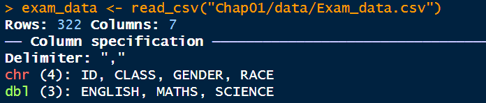
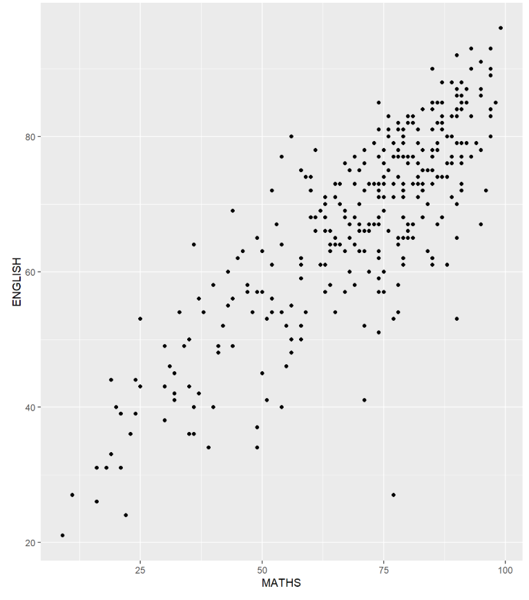

# **1. A Layered Grammar of Graphics: ggplot2 methods**

## **1.1 Learning Outcomes**

-   Understand core concepts of ggplot2
-   Learn key components of the Grammar of Graphics
-   Apply layered approach to build visualisations
-   Create clear, functional statistical plots
-   Produce clean and effective data visualisations

## **1.2 Getting Started**

### **1.2.1 Installing and loading the required libraries**

This code chunk uses pacman's p_load() to load tidyverse family of package into R environment.

```{r}
pacman::p_load(tidyverse)

```

------------------------------------------------------------------------

### **1.2.2 Importing data**

The code chunk below imports *exam_data.csv* into R environment by using [*read_csv()*](https://readr.tidyverse.org/reference/read_delim.html) function of [**readr**](https://readr.tidyverse.org/) package.

```{r}
exam_data <- read_csv("Chap01/data/Exam_data.csv")

```

{width="428" height="94"}

------------------------------------------------------------------------

## **1.3 Introducing ggplot**

ggplot2 is an R package for declaratively creating data-driven graphics based on The Grammar of Graphics.

It is also part of the tidyverse family specially designed for visual exploration and communication.

### **1.3.1 R Graphics VS ggplot**

Let us compare how R Graphics, the core graphical functions of Base R and ggplot plot a simple histogram.

#### R Graphics

```{r}
hist(exam_data$MATHS)

```

#### ggplot2

```{r}
ggplot(data=exam_data, aes(x = MATHS)) +
  geom_histogram(bins=10, 
                 boundary = 100,
                 color="black", 
                 fill="grey") +
  ggtitle("Distribution of Maths scores")

```

As you can see that the code chunk is relatively simple if R Graphics is used. Then, the question is why ggplot2 is recommended?

## **1.4 Grammar of Graphics**

Grammar of Graphics defines the rules of structuring mathematical and aesthetic elements into a meaningful graph.

There are two principles in Grammar of Graphics, they are:

-   Graphics = distinct layers of grammatical elements

-   Meaningful plots through aesthetic mapping

A good grammar of graphics will allow us to gain insight into the composition of complicated graphics, and reveal unexpected connections between seemingly different graphics (Cox 1978). It also provides a strong foundation for understanding a diverse range of graphics. Furthermore, it may also help guide us on what a well-formed or correct graphic looks like, but there will still be many grammatically correct but nonsensical graphics.

### **1.4.1 A Layered Grammar of Graphics**

ggplot2 is an implementation of Leland Wilkinson’s Grammar of Graphics. Figure below shows the seven grammars of ggplot2.

{width="365"}

## **1.5 Essential Grammatical Elements in ggplot2: data**

Let us call the `ggplot()` function using the code chunk below.

```{r}
ggplot(data=exam_data)

```

## **1.6 Essential Grammatical Elements in ggplot2: [Aesthetic mappings](https://ggplot2.tidyverse.org/articles/ggplot2-specs.html)**

The code chunk below adds the aesthetic element into the plot.

```{r}
ggplot(data=exam_data, 
       aes(x= MATHS))

```

## **1.7 Essential Grammatical Elements in ggplot2: geom**

Geometric objects are the actual marks we put on a plot.

A plot must have at least one geom; there is no upper limit. You can add a geom to a plot using the **+** operator.

{width="439"}

### **1.7.1 Geometric Objects: geom_bar**

The code chunk below plots a bar chart by using [`geom_bar()`](https://ggplot2.tidyverse.org/reference/geom_bar.html).

```{r}
ggplot(data=exam_data, 
       aes(x=RACE)) +
  geom_bar()

```

### **1.7.2 Geometric Objects: geom_dotplot**

In the code chunk below, [`geom_dotplot()`](https://ggplot2.tidyverse.org/reference/geom_dotplot.html) of ggplot2 is used to plot a dot plot.

```{r}
ggplot(data=exam_data, 
       aes(x = MATHS)) +
  geom_dotplot(dotsize = 0.5)

```

Turn off y-axis and change binwidth to 2.5

```{r}
ggplot(data=exam_data, 
       aes(x = MATHS)) +
  geom_dotplot(binwidth=2.5,         
               dotsize = 0.5) +      
  scale_y_continuous(NULL,           
                     breaks = NULL) 

```

### **1.7.3 Geometric Objects: `geom_histogram()`**

In the code chunk below, [*geom_histogram()*](https://ggplot2.tidyverse.org/reference/geom_histogram.html) is used to create a simple histogram by using values in *MATHS* field of *exam_data*.

Note that the default bin is **30**.

```{r}
ggplot(data=exam_data, 
       aes(x = MATHS)) +
  geom_histogram() 

```

### **1.7.4 Modifying a geometric object by changing `geom()`**

In the code chunk below,

-   *bins* argument is used to change the number of bins to 20,

-   *fill* argument is used to shade the histogram with light blue color, and

-   *color* argument is used to change the outline colour of the bars in black

```{r}
ggplot(data=exam_data, 
       aes(x= MATHS)) +
  geom_histogram(bins=20,            
                 color="black",      
                 fill="light blue") 

```

### **1.7.5 Modifying a geometric object by changing *aes()***

The code chunk below changes the interior colour of the histogram (i.e. *fill*) by using sub-group of *aesthetic()*.

```{r}
ggplot(data=exam_data, 
       aes(x= MATHS, 
           fill = GENDER)) +
  geom_histogram(bins=20, 
                 color="grey30") 

```

### **1.7.6 Geometric Objects: geom-density()**

The code below plots the distribution of Maths scores in a kernel density estimate plot.

```{r}
ggplot(data=exam_data, 
       aes(x = MATHS)) +
  geom_density() 

```

The code chunk below plots two kernel density lines by using colour or fill arguments of aes()

```{r}
ggplot(data=exam_data, 
       aes(x = MATHS, 
           colour = GENDER)) +
  geom_density()

```

### **1.7.7 Geometric Objects: geom_boxplot**

The code chunk below plots boxplots by using [`geom_boxplot()`](https://ggplot2.tidyverse.org/reference/geom_boxplot.html).

```{r}
ggplot(data=exam_data, 
       aes(y = MATHS,       
           x= GENDER)) +    
  geom_boxplot() 

```

The code chunk below plots the distribution of Maths scores by gender in notched plot instead of boxplot.

```{r}
ggplot(data=exam_data, 
       aes(y = MATHS, 
           x= GENDER)) +
  geom_boxplot(notch=TRUE)

```

### **1.7.8 Geometric Objects: geom_violin**

The code below plot the distribution of Maths score by gender in violin plot.

```{r}
ggplot(data=exam_data, 
       aes(y = MATHS, 
           x= GENDER)) +
  geom_violin()

```

### **1.7.9 Geometric Objects: geom_point()**

[`geom_point()`](https://ggplot2.tidyverse.org/reference/geom_point.html) is especially useful for creating scatterplot.

The code chunk below plots a scatterplot showing the Maths and English grades of pupils by using `geom_point()`.

```{r}
ggplot(data=exam_data, 
       aes(x= MATHS, 
           y=ENGLISH)) +
  geom_point() 

```

### **1.7.10 *geom* objects can be combined**

The code chunk below plots the data points on the boxplots by using both `geom_boxplot()` and `geom_point()`.

```{r}
ggplot(data=exam_data, 
       aes(y = MATHS, 
           x= GENDER)) +
  geom_boxplot() +                    
  geom_point(position="jitter", 
             size = 0.5) 

```

## **1.8 Essential Grammatical Elements in ggplot2: stat**

The [Statistics functions](https://ggplot2.tidyverse.org/reference/index.html#stats) statistically transform data, usually as some form of summary. For example:

-   frequency of values of a variable (bar graph)

    -   a mean

    -   a confidence limit

-   There are two ways to use these functions:

    -   add a `stat_()` function and override the default geom, or

    -   add a `geom_()` function and override the default stat.

### **1.8.1 Working with `stat()`**

The boxplots below are incomplete because the positions of the means were not shown.

```{r}
ggplot(data=exam_data, 
       aes(y = MATHS, x= GENDER)) +
  geom_boxplot()

```

### **1.8.2 Working with stat - the *stat_summary()* method**

The code chunk below adds mean values by using [`stat_summary()`](https://ggplot2.tidyverse.org/reference/stat_summary.html) function and overriding the default geom.

```{r}
ggplot(data=exam_data, 
       aes(y = MATHS, x= GENDER)) +
  geom_boxplot() +
  stat_summary(geom = "point",       
               fun = "mean",         
               colour ="red",        
               size=4)

```

### **1.8.3 Working with stat - the `geom()` method**

The code chunk below adding mean values by using `geom_()` function and overriding the default stat.

```{r}
ggplot(data=exam_data, 
       aes(y = MATHS, x= GENDER)) +
  geom_boxplot() +
  geom_point(stat="summary",        
             fun="mean",           
             colour="red",          
             size=4) 

```

### **1.8.4 Adding a best fit curve on a scatterplot?**

The scatterplot below shows the relationship of Maths and English grades of pupils. The interpretability of this graph can be improved by adding a best fit curve.

{width="516"}

In the code chunk below, [`geom_smooth()`](https://ggplot2.tidyverse.org/reference/geom_smooth.html) is used to plot a best fit curve on the scatterplot.

```{r}
ggplot(data=exam_data, 
       aes(x= MATHS, y=ENGLISH)) +
  geom_point() +
  geom_smooth(size=0.5)

```

The default smoothing method can be overridden as shown below.

```{r}
ggplot(data=exam_data, 
       aes(x= MATHS, 
           y=ENGLISH)) +
  geom_point() +
  geom_smooth(method=lm, 
              linewidth=0.5)

```

## **1.9 Essential Grammatical Elements in ggplot2: Facets**

Facetting generates small multiples (sometimes also called trellis plot), each displaying a different subset of the data. They are an alternative to aesthetics for displaying additional discrete variables. ggplot2 supports two types of factes, namely: [`facet_grid()`](https://ggplot2.tidyverse.org/reference/facet_grid.html) and [`facet_wrap`](https://ggplot2.tidyverse.org/reference/facet_wrap.html).

### **1.9.1 Working with `facet_wrap()`**

The code chunk below plots a trellis plot using `facet-wrap()`.

```{r}
ggplot(data=exam_data, 
       aes(x= MATHS)) +
  geom_histogram(bins=20) +
    facet_wrap(~ CLASS)

```

### **1.9.2 `facet_grid()` function**

The code chunk below plots a trellis plot using `facet_grid()`.

```{r}
ggplot(data=exam_data, 
       aes(x= MATHS)) +
  geom_histogram(bins=20) +
    facet_grid(~ CLASS)

```

## **1.10 Essential Grammatical Elements in ggplot2: Coordinates**

The *Coordinates* functions map the position of objects onto the plane of the plot.

### **1.10.1 Working with Coordinate**

By the default, the bar chart of ggplot2 is in vertical form.

```{r}
ggplot(data=exam_data, 
       aes(x=RACE)) +
  geom_bar()

```

The code chunk below flips the horizontal bar chart into vertical bar chart by using `coord_flip()`.

```{r}
ggplot(data=exam_data, 
       aes(x=RACE)) +
  geom_bar() +
  coord_flip()

```

### **1.10.2 Changing the y- and x-axis range**

The scatterplot below is slightly misleading because the y-aixs and x-axis range are not equal.

```{r}
ggplot(data=exam_data, 
       aes(x= MATHS, y=ENGLISH)) +
  geom_point() +
  geom_smooth(method=lm, size=0.5)

```

The code chunk below fixed both the y-axis and x-axis range from 0-100.

```{r}
ggplot(data=exam_data, 
       aes(x= MATHS, y=ENGLISH)) +
  geom_point() +
  geom_smooth(method=lm, 
              size=0.5) +  
  coord_cartesian(xlim=c(0,100),
                  ylim=c(0,100))

```

## **1.11 Essential Grammatical Elements in ggplot2: themes**

Themes control elements of the graph not related to the data. For example:

-   background colour

-   size of fonts

-   gridlines

-   colour of labels

### **1.11.1 Working with theme**

The code chunk below plot a horizontal bar chart using `theme_gray()`.

```{r}
ggplot(data=exam_data, 
       aes(x=RACE)) +
  geom_bar() +
  coord_flip() +
  theme_gray()

```

A horizontal bar chart plotted using `theme_classic()`.

```{r}
ggplot(data=exam_data, 
       aes(x=RACE)) +
  geom_bar() +
  coord_flip() +
  theme_classic()

```

A horizontal bar chart plotted using `theme_minimal()`.

```{r}
ggplot(data=exam_data, 
       aes(x=RACE)) +
  geom_bar() +
  coord_flip() +
  theme_minimal()

```

**END**
