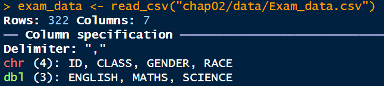

# **2**. **Beyond ggplot2 Fundamentals**

## **2.1 Learning Outcomes**

-   Explore ggplot2 extensions for enhanced visualisation
-   Improve annotation placement using ggrepel
-   Create publication-quality plots with ggthemes and hrbrthemes
-   Combine multiple plots using patchwork

## **2.2 Getting Started**

### **2.2.1 Installing and loading the required libraries**

This code chunk below will be used to load them into R environment.

```{r}
pacman::p_load(ggrepel, patchwork, ggthemes, hrbrthemes, tidyverse) 

```

### **2.2.2 Importing data**

The code chunk below imports *exam_data.csv* into R environment by using [*read_csv()*](https://readr.tidyverse.org/reference/read_delim.html) function of [**readr**](https://readr.tidyverse.org/) package.

```{r}
exam_data <- read_csv("chap02/data/Exam_data.csv") 

```

{width="415"}

## **2.3 Beyond ggplot2 Annotation: ggrepel**

One of the challenge in plotting statistical graph is annotation, especially with large number of data points.

```{r}
ggplot(data=exam_data, 
       aes(x= MATHS, 
           y=ENGLISH)) +
  geom_point() +
  geom_smooth(method=lm, 
              size=0.5) +  
  geom_label(aes(label = ID), 
             hjust = .5, 
             vjust = -.5) +
  coord_cartesian(xlim=c(0,100),
                  ylim=c(0,100)) +
  ggtitle("English scores versus Maths scores for Primary 3") 

```

ggrepel is an extension of ggplot2 package which provides geoms for ggplot2 to repel overlapping text.

We simply replace `geom_text()` by [`geom_text_repel()`](https://ggrepel.slowkow.com/reference/geom_text_repel.html) and `geom_label()` by [`geom_label_repel`](https://ggrepel.slowkow.com/reference/geom_text_repel.html).

### **2.3.1 Working with ggrepel**

```{r}
ggplot(data=exam_data, 
       aes(x= MATHS, 
           y=ENGLISH)) +
  geom_point() +
  geom_smooth(method=lm, 
              size=0.5) +  
  geom_label_repel(aes(label = ID), 
                   fontface = "bold") +
  coord_cartesian(xlim=c(0,100),
                  ylim=c(0,100)) +
  ggtitle("English scores versus Maths scores for Primary 3") 

```

## **2.4 Beyond ggplot2 Themes**

ggplot2 comes with eight [built-in themes](https://ggplot2.tidyverse.org/reference/ggtheme.html), they are: `theme_gray()`, `theme_bw()`, `theme_classic()`, `theme_dark()`, `theme_light()`, `theme_linedraw()`, `theme_minimal()`, and `theme_void()`.

```{r}
ggplot(data=exam_data, 
             aes(x = MATHS)) +
  geom_histogram(bins=20, 
                 boundary = 100,
                 color="grey25", 
                 fill="grey90") +
  theme_gray() +
  ggtitle("Distribution of Maths scores")  

```

### **2.4.1 Working with ggtheme package**

[**ggthemes**](https://cran.r-project.org/web/packages/ggthemes/index.html) provides [‘ggplot2’ themes](https://yutannihilation.github.io/allYourFigureAreBelongToUs/ggthemes/) that replicate the look of plots by Edward Tufte, Stephen Few, [Fivethirtyeight](https://fivethirtyeight.com/), [The Economist](https://www.economist.com/graphic-detail), ‘Stata’, ‘Excel’, and [The Wall Street Journal](https://www.pinterest.com/wsjgraphics/wsj-graphics/), among others.

In the example below, *The Economist* theme is used.

```{r}
ggplot(data=exam_data, 
             aes(x = MATHS)) +
  geom_histogram(bins=20, 
                 boundary = 100,
                 color="grey25", 
                 fill="grey90") +
  ggtitle("Distribution of Maths scores") +
  theme_economist()  

```

It also provides some extra geoms and scales for ‘ggplot2’.

### **2.4.2 Working with hrbthems package**

[**hrbrthemes**](https://cran.r-project.org/web/packages/hrbrthemes/index.html) package provides a base theme that focuses on typographic elements, including where various labels are placed as well as the fonts that are used.

```{r}
ggplot(data=exam_data, 
             aes(x = MATHS)) +
  geom_histogram(bins=20, 
                 boundary = 100,
                 color="grey25", 
                 fill="grey90") +
  ggtitle("Distribution of Maths scores") +
  theme_ipsum() 

```

The second goal centers around productivity for a production workflow. In fact, this “production workflow” is the context for where the elements of hrbrthemes should be used.

```{r}
ggplot(data=exam_data, 
             aes(x = MATHS)) +
  geom_histogram(bins=20, 
                 boundary = 100,
                 color="grey25", 
                 fill="grey90") +
  ggtitle("Distribution of Maths scores") +
  theme_ipsum(axis_title_size = 18,
              base_size = 15,
              grid = "Y")

```

Note that:

-   `axis_title_size` argument is used to increase the font size of the axis title to 18,

-   `base_size` argument is used to increase the default axis label to 15, and

-   `grid` argument is used to remove the x-axis grid lines.

## **2.5 Beyond Single Graph**

It is not unusual that multiple graphs are required to tell a compelling visual story. There are several ggplot2 extensions provide functions to compose figure with multiple graphs.

In this section, you will learn how to create composite plot by combining multiple graphs.

First, let us create three statistical graphics by using the code chunk below.

```{r}
p1 <- ggplot(data=exam_data, 
             aes(x = MATHS)) +
  geom_histogram(bins=20, 
                 boundary = 100,
                 color="grey25", 
                 fill="grey90") + 
  coord_cartesian(xlim=c(0,100)) +
  ggtitle("Distribution of Maths scores")
print(p1)

```

Next

```{r}
p2 <- ggplot(data=exam_data, 
             aes(x = ENGLISH)) +
  geom_histogram(bins=20, 
                 boundary = 100,
                 color="grey25", 
                 fill="grey90") +
  coord_cartesian(xlim=c(0,100)) +
  ggtitle("Distribution of English scores")
print(p2)

```

Lastly, we will draw a scatterplot for English score versus Maths score by as shown below.

```{r}
p3 <- ggplot(data=exam_data, 
             aes(x= MATHS, 
                 y=ENGLISH)) +
  geom_point() +
  geom_smooth(method=lm, 
              size=0.5) +  
  coord_cartesian(xlim=c(0,100),
                  ylim=c(0,100)) +
  ggtitle("English scores versus Maths scores for Primary 3")
print(p3)

```

### **2.5.1 Creating Composite Graphics: pathwork methods**

There are several ggplot2 extension’s functions support the needs to prepare composite figure by combining several graphs such as [`grid.arrange()`](https://cran.r-project.org/web/packages/gridExtra/vignettes/arrangeGrob.html) of **gridExtra** package and [`plot_grid()`](https://wilkelab.org/cowplot/reference/plot_grid.html) of [**cowplot**](https://wilkelab.org/cowplot/index.html) package. In this section, I am going to shared with you an ggplot2 extension called [**patchwork**](https://patchwork.data-imaginist.com/) which is specially designed for combining separate ggplot2 graphs into a single figure.

Patchwork package has a very simple syntax where we can create layouts super easily. Here’s the general syntax that combines:

-   Two-Column Layout using the Plus Sign +.

-   Parenthesis () to create a subplot group.

-   Two-Row Layout using the Division Sign `/`

### **2.5.2 Combining two ggplot2 graphs**

Figures in the tabset below shows a composite of two histograms created using patchwork. Note how simple the syntax used to create the plot!

```{r}
p1 + p2

```

### **2.5.3 Combining three ggplot2 graphs**

We can plot more complex composite by using appropriate operators.

For example, the composite figure below is plotted by using:

-   “/” operator to stack two ggplot2 graphs,

-   “\|” operator to place the plots beside each other,

-   “()” operator the define the sequence of the plotting.

```{r}
(p1 / p2) | p3

```

### **2.5.4 Creating a composite figure with tag**

In order to identify subplots in text, **patchwork** also provides auto-tagging capabilities as shown in the figure below.

```{r}
((p1 / p2) | p3) + 
  plot_annotation(tag_levels = 'I')

```

### **2.5.5 Creating figure with insert**

Beside providing functions to place plots next to each other based on the provided layout. With [`inset_element()`](https://patchwork.data-imaginist.com/reference/inset_element.html) of **patchwork**, we can place one or several plots or graphic elements freely on top or below another plot.

```{r}
p3 + inset_element(p2, 
                   left = 0.02, 
                   bottom = 0.7, 
                   right = 0.5, 
                   top = 1)

```

### **2.5.6 Creating a composite figure by using patchwork and ggtheme**

The figure below is created by combining patchwork and theme_economist() of ggthemes package discussed earlier.

```{r}
patchwork <- (p1 / p2) | p3
patchwork & theme_economist()

```

**END**
