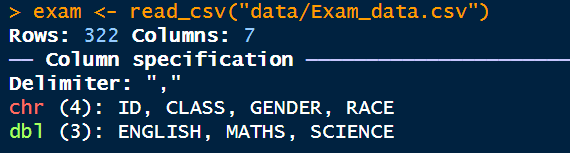

# **7. Visualising Uncertainty**

## **7.1 Learning Outcome**

- Gain hands-on experience on creating statistical graphics for visualising uncertainty

- Plot statistics error bars by using ggplot2

- Plot interactive error bars by combining ggplot2, plotly and DT

- Create advanced by using ggdist

- Create hypothetical outcome plots (HOPs) by using ungeviz package

## **7.2 Getting Started**

### **7.2.1 Installing and loading the packages**

The code chunk below will be used load these R packages into RStudio environment.

```{r}
pacman::p_load(plotly, crosstalk, DT, 
               ggdist, ggridges, colorspace,
               gganimate, tidyverse)

```

### **7.2.2 Data import**

For the purpose of this exercise, *Exam_data.csv* will be used.

```{r}
exam <- read_csv("data/Exam_data.csv")

```

{width="409"}

## **7.3 Visualizing the uncertainty of point estimates: ggplot2 methods**

A point estimate is a single number, such as a mean. Uncertainty, on the other hand, is expressed as standard error, confidence interval, or credible interval.

::: callout-important
Don’t confuse the uncertainty of a point estimate with the variation in the sample
:::

In this section, you will learn how to plot error bars of maths scores by race by using data provided in *exam* tibble data frame.

Firstly, code chunk below will be used to derive the necessary summary statistics.

```{r}
my_sum <- exam %>%
  group_by(RACE) %>%
  summarise(
    n=n(),
    mean=mean(MATHS),
    sd=sd(MATHS)
    ) %>%
  mutate(se=sd/sqrt(n-1))

```

Things to learn from the code chunk above:

- `group_by()` of **dplyr** package is used to group the observation by RACE,

- `summarise()` is used to compute the count of observations, mean, standard deviation

- `mutate()` is used to derive standard error of Maths by RACE, and

- the output is save as a tibble data table called *my_sum*.

Next, the code chunk below will be used to display *my_sum* tibble data frame in an html table format.

```{r}
knitr::kable(head(my_sum), format = 'html')

```

### **7.3.1 Plotting standard error bars of point estimates**

Now we are ready to plot the standard error bars of mean maths score by race as shown below.

Things to learn from the code chunk below:

- The error bars are computed by using the formula mean+/-se.

- For `geom_point()`, it is important to indicate *stat=“identity”*.

```{r}
ggplot(my_sum) +
  geom_errorbar(
    aes(x=RACE, 
        ymin=mean-se, 
        ymax=mean+se), 
    width=0.2, 
    colour="black", 
    alpha=0.9, 
    linewidth=0.5) +
  geom_point(aes
           (x=RACE, 
            y=mean), 
           stat="identity", 
           color="red",
           size = 1.5,
           alpha=1) +
  ggtitle("Standard error of mean maths score by race")

```

### **7.3.2 Plotting confidence interval of point estimates**

Instead of plotting the standard error bar of point estimates, we can also plot the confidence intervals of mean maths score by race.

Things to learn from the code chunk below:

- The confidence intervals are computed by using the formula mean+/-1.96\*se.

- The error bars is sorted by using the average maths scores.

- `labs()` argument of ggplot2 is used to change the x-axis label.

```{r}
ggplot(my_sum) +
  geom_errorbar(
    aes(x=reorder(RACE, -mean), 
        ymin=mean-1.96*se, 
        ymax=mean+1.96*se), 
    width=0.2, 
    colour="black", 
    alpha=0.9, 
    linewidth=0.5) +
  geom_point(aes
           (x=RACE, 
            y=mean), 
           stat="identity", 
           color="red",
           size = 1.5,
           alpha=1) +
  labs(x = "Maths score",
       title = "95% confidence interval of mean maths score by race")

```

### **7.3.3 Visualizing the uncertainty of point estimates with interactive error bars**

In this section, you will learn how to plot interactive error bars for the 99% confidence interval of mean maths score by race as shown in the figure below.

```{r}
shared_df = SharedData$new(my_sum)

bscols(widths = c(4,8),
       ggplotly((ggplot(shared_df) +
                   geom_errorbar(aes(
                     x=reorder(RACE, -mean),
                     ymin=mean-2.58*se, 
                     ymax=mean+2.58*se), 
                     width=0.2, 
                     colour="black", 
                     alpha=0.9, 
                     size=0.5) +
                   geom_point(aes(
                     x=RACE, 
                     y=mean, 
                     text = paste("Race:", `RACE`, 
                                  "<br>N:", `n`,
                                  "<br>Avg. Scores:", round(mean, digits = 2),
                                  "<br>95% CI:[", 
                                  round((mean-2.58*se), digits = 2), ",",
                                  round((mean+2.58*se), digits = 2),"]")),
                     stat="identity", 
                     color="red", 
                     size = 1.5, 
                     alpha=1) + 
                   xlab("Race") + 
                   ylab("Average Scores") + 
                   theme_minimal() + 
                   theme(axis.text.x = element_text(
                     angle = 45, vjust = 0.5, hjust=1)) +
                   ggtitle("99% Confidence interval of average /<br>maths scores by race")), 
                tooltip = "text"), 
       DT::datatable(shared_df, 
                     rownames = FALSE, 
                     class="compact", 
                     width="100%", 
                     options = list(pageLength = 10,
                                    scrollX=T), 
                     colnames = c("No. of pupils", 
                                  "Avg Scores",
                                  "Std Dev",
                                  "Std Error")) %>%
         formatRound(columns=c('mean', 'sd', 'se'),
                     digits=2))

```

## **7.4 Visualising Uncertainty: ggdist package**

- [**ggdist**](https://mjskay.github.io/ggdist/index.html) is an R package that provides a flexible set of ggplot2 geoms and stats designed especially for visualising distributions and uncertainty.

- It is designed for both frequentist and Bayesian uncertainty visualization, taking the view that uncertainty visualization can be unified through the perspective of distribution visualization:

  - for frequentist models, one visualises confidence distributions or bootstrap distributions (see vignette(“freq-uncertainty-vis”));

  - for Bayesian models, one visualises probability distributions (see the tidybayes package, which builds on top of ggdist).

### **7.4.1 Visualizing the uncertainty of point estimates: ggdist methods**

In the code chunk below, [`stat_pointinterval()`](https://mjskay.github.io/ggdist/reference/stat_pointinterval.html) of **ggdist** is used to build a visual for displaying distribution of maths scores by race.

```{r}
exam %>%
  ggplot(aes(x = RACE, 
             y = MATHS)) +
  stat_pointinterval() +
  labs(
    title = "Visualising confidence intervals of mean math score",
    subtitle = "Mean Point + Multiple-interval plot")

```

For example, in the code chunk below the following arguments are used:

- .width = 0.95

- .point = median

- .interval = qi

```{r}
exam %>%
  ggplot(aes(x = RACE, y = MATHS)) +
  stat_pointinterval(.width = 0.95,
  .point = median,
  .interval = qi) +
  labs(
    title = "Visualising confidence intervals of median math score",
    subtitle = "Median Point + Multiple-interval plot")

```

### **7.4.2 Visualizing the uncertainty of point estimates: ggdist methods**

```{r}
exam %>%
  ggplot(aes(x = RACE, 
             y = MATHS)) +
  stat_pointinterval(
    show.legend = FALSE) +   
  labs(
    title = "Visualising confidence intervals of mean math score",
    subtitle = "Mean Point + Multiple-interval plot")

```

### **Exploration**

**Makeover the plot on previous slide by showing 95% and 99% confidence intervals**

```{r}
exam %>%
  ggplot(aes(x = RACE, y = MATHS)) +
  stat_pointinterval(
    .width = c(0.95, 0.99), 
    show.legend = FALSE
  ) +
  labs(
    title = "Visualising confidence intervals of mean math score",
    subtitle = "Mean Point + 95% & 99% CI"
  )

```

Observations:

- Point = Mean, Thicker inner line = 95% CI, Thinner outer line = 99% CI

- This enhancement provides a clearer visualisation of the uncertainty associated with the estimated mean mathematics scores across different racial groups. The inclusion of two confidence levels allows for better comparison of variability and reliability, with the wider 99% interval reflecting greater uncertainty than the narrower 95% interval.

- However, the confidence intervals suggest that the differences in mean scores are small relative to the overall variability. This indicates that the differences between groups may not be meaningful and should be interpreted with caution.

### **7.4.3 Visualizing the uncertainty of point estimates: ggdist methods**

In the code chunk below, [`stat_gradientinterval()`](https://mjskay.github.io/ggdist/reference/stat_gradientinterval.html) of **ggdist** is used to build a visual for displaying distribution of maths scores by race.

```{r}
exam %>%
  ggplot(aes(x = RACE, 
             y = MATHS)) +
  stat_gradientinterval(   
    fill = "skyblue",      
    show.legend = TRUE     
  ) +                        
  labs(
    title = "Visualising confidence intervals of mean math score",
    subtitle = "Gradient + interval plot")

```

## **7.5 Visualising Uncertainty with Hypothetical Outcome Plots (HOPs)**

### **7.5.1 Installing ungeviz package**

```{r}
devtools::install_github("wilkelab/ungeviz")

```

### **7.5.2 Launch the application in R**

```{r}
library(ungeviz)

```

### **7.5.3 Visualising Uncertainty with Hypothetical Outcome Plots (HOPs)**

Next, the code chunk below will be used to build the HOPs.

```{r}
ggplot(data = exam, 
       (aes(x = factor(RACE), 
            y = MATHS))) +
  geom_point(position = position_jitter(
    height = 0.3, 
    width = 0.05), 
    size = 0.4, 
    color = "#0072B2", 
    alpha = 1/2) +
  geom_hpline(data = sampler(25, 
                             group = RACE), 
              height = 0.6, 
              color = "#D55E00") +
  theme_bw() + 
  transition_states(.draw, 1, 3)

```
